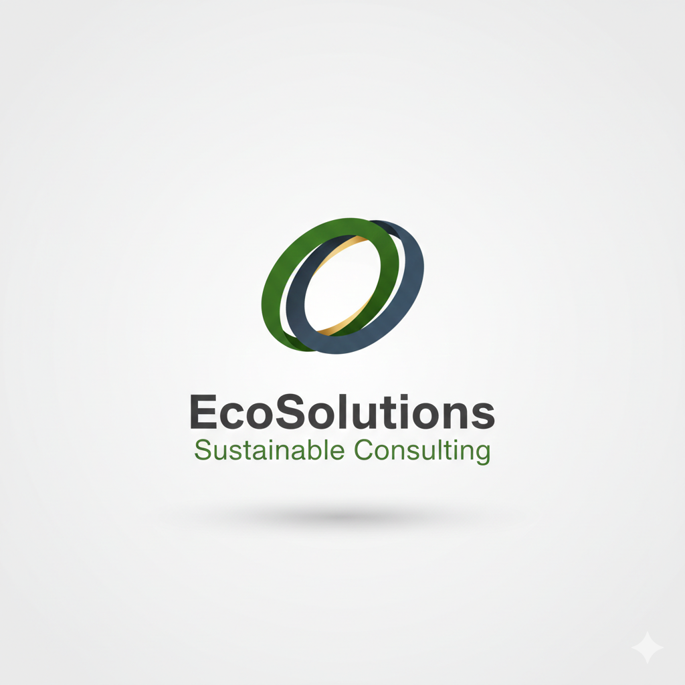

# EcoSolutions: Sustainable Consulting Website



A professional, responsive website for EcoSolutions, a sustainable consulting firm. This project is built following modern web development best practices, focusing on semantic HTML, a robust CSS architecture with variables, and essential JavaScript for enhanced user experience.

---

## Table of Contents

1.  [Project Overview](##project-overview)
2.  [Features](#features)
3.  [Live Demo](#live-demo) (Once deployed)
4.  [Technology Stack](#technology-stack)
5.  [Setup and Installation](#setup-and-installation)
6.  [Project Structure](#project-structure)
7.  [Development Progress](#development-progress)
8.  [Next Steps & Future Enhancements](#next-steps--future-enhancements)
9.  [License](#license)
10. [Contact](#contact)

---

## 1. Project Overview

EcoSolutions is a consulting firm dedicated to helping businesses integrate sustainable practices that drive efficiency, reduce costs, and enhance brand reputation. This website serves as their primary online presence, designed to be professional, informative, and user-friendly. It showcases their mission, core services, client testimonials, and provides a clear call to action for potential clients.

This project was completed rapidly over three days, emphasizing modularity, maintainability, and a "human coding" style for clarity and ease of understanding.

## 2. Features

* **Responsive Design:** Adapts seamlessly to various screen sizes (desktop, tablet, mobile) with a mobile-first approach.
* **Professional Aesthetic:** Clean and modern design with a refined color palette and typography (using CSS variables for easy theming).
* **Clear Navigation:** Intuitive main navigation with smooth scrolling to sections and a responsive hamburger menu for mobile.
* **Active Nav Links:** Highlights the current section in the navigation as the user scrolls.
* **Engaging Hero Section:** Full-viewport introduction with a compelling background image and clear call to action.
* **Informative Sections:** Dedicated sections for "About Us," "Our Core Services," and "Client Testimonials."
* **Interactive Contact Form:** Client-side validation for immediate user feedback.
* **Enhanced Footer:** Comprehensive footer with navigation and social media links.

## 3. Live Demo

[Link to live demo here once deployed!](<https://wasimabbasjoyia.github.io/eco-solutions-website-sprint/>)


## 4. Technology Stack

* **HTML5:** For semantic and structured content.
* **CSS3:** For styling, utilizing CSS Variables for easy theming and maintainability, along with Flexbox and Grid for responsive layouts.
* **JavaScript (ES6+):** For interactive elements such as mobile navigation toggling, smooth scrolling, active link highlighting (using Intersection Observer), and client-side form validation.
* **Google Fonts:** `Open Sans` (body) and `Roboto Slab` (headings) for a professional typographic scheme.

## 5. Setup and Installation

To get a local copy of this project up and running, follow these simple steps.

### Prerequisites

You need a modern web browser (e.g., Chrome, Firefox, Safari, Edge) to view the project. No special server setup is required for basic local viewing.

### Installation

1.  **Clone the repository:**
    ```bash
    git clone [https://github.com/wasimabbasjoyia/eco-solutions-website-sprint.git](https://github.com/wasimabbasjoyia/eco-solutions-website-sprint.git)
    ```
2.  **Navigate to the project directory:**
    ```bash
    cd eco-solutions-website-sprint
    ```
3.  **Open `index.html`:**
    Simply open the `index.html` file in your preferred web browser.

    Alternatively, if you have a local development server set up (like the "Live Server" extension for VS Code), you can serve the directory to get live reloading and a proper local URL.

## 6. Project Structure

The project has a straightforward and organized file structure:

```
eco-solutions-website-sprint/
├── index.html          # Main HTML file for the website
├── style.css           # All CSS rules, including variables and responsive styles
├── script.js           # All JavaScript for interactivity and client-side validation
└── docs/               # Directory for documentation, screenshots, and assets
    └── logo_concept_1.png # Logo image used in README
└── README.md           # This file
```

## 7. Development Progress

This project was developed efficiently over a three-day sprint, covering all essential front-end aspects:

* **HTML Structure:** Established a robust and semantic HTML foundation for all key sections including header, hero, about, services, testimonials, contact form, and footer.
* **CSS Styling:** Implemented a professional and consistent design using a well-defined CSS architecture. This included:
    * **CSS Variables:** For easy theme management (colors, fonts, spacing).
    * **Responsive Layouts:** Utilized Flexbox and CSS Grid for adaptable designs across various screen sizes (mobile-first approach).
    * **Component Styling:** Detailed styling for navigation, buttons, service cards, testimonials, and the contact form elements.
* **JavaScript Interactivity:** Integrated essential JavaScript functionalities for an enhanced user experience:
    * **Mobile Navigation Toggle:** For a responsive hamburger menu.
    * **Smooth Scrolling:** For seamless navigation between page sections.
    * **Active Link Highlighting:** Using `IntersectionObserver` to indicate the current section in the navigation.
    * **Client-Side Form Validation:** Provides immediate feedback for the contact form, improving user interaction.

## 8. Next Steps & Future Enhancements

The website is now fully functional, but there are always ways to improve and expand a project.

* **Server-Side Form Handling:** Implement a backend (e.g., using Node.js, Python/Flask, PHP) to actually process and store contact form submissions securely.
* **Enhanced Accessibility (A11y):** Conduct a deeper accessibility audit, adding ARIA attributes where appropriate, refining keyboard navigation, and ensuring sufficient color contrast.
* **Performance Optimization:**
    * **Image Compression:** Use tools like TinyPNG or Squoosh.app to further optimize all image assets for faster loading.
    * **Lazy Loading:** Implement `loading="lazy"` on `` tags for images below the fold.
    * **Code Minification:** Minify `style.css` and `script.js` for production deployment.
* **Cross-Browser Compatibility:** Thoroughly test across a wider range of browsers and devices (real devices, not just emulators).
* **SEO Optimization:** Add a `<meta name="description">`, explore structured data (Schema.org), and consider integrating Google Analytics.
* **Interactive Elements:** Potentially add subtle animations or transitions for elements entering the viewport (e.g., using libraries like AOS).
* **Dedicated 404 Page:** Create a custom error page for broken links.

## 9. License

This project is open-source and available under the [MIT License](LICENSE).

## 10. Contact

If you have any questions or feedback, feel free to reach out!

**Wasim Abbas Joyia** - [<wasimabbasjoyia@gmail.com>](mailto:wasimabbasjoyia@gmail.com)
Project Repository: <https://github.com/wasimabbasjoyia/eco-solutions-website-sprint>

---
